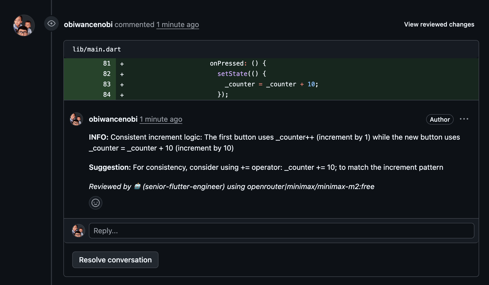
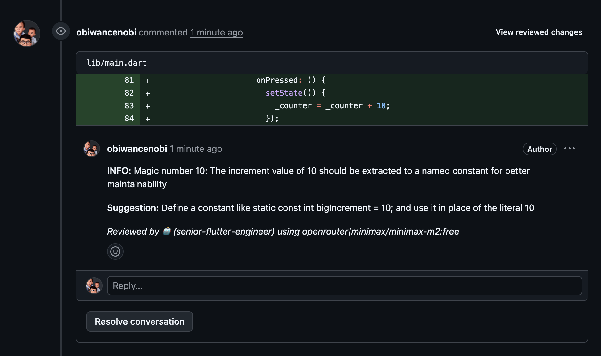
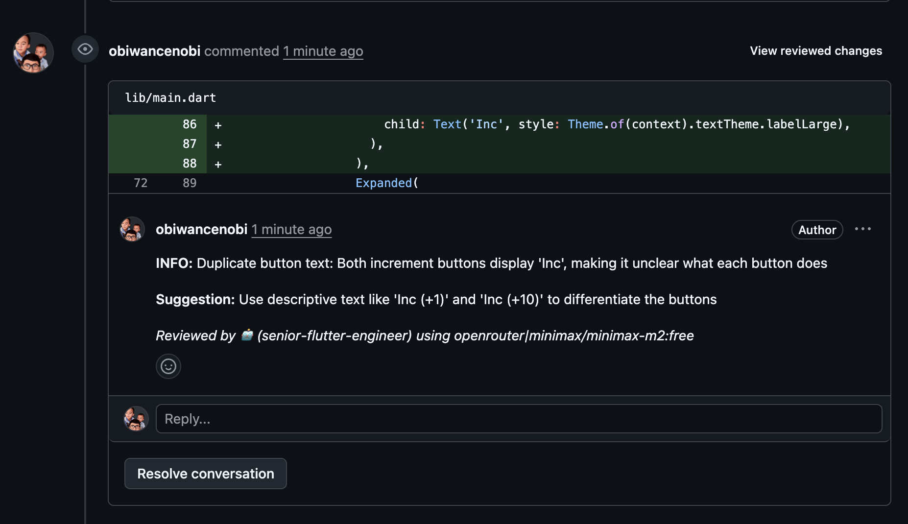
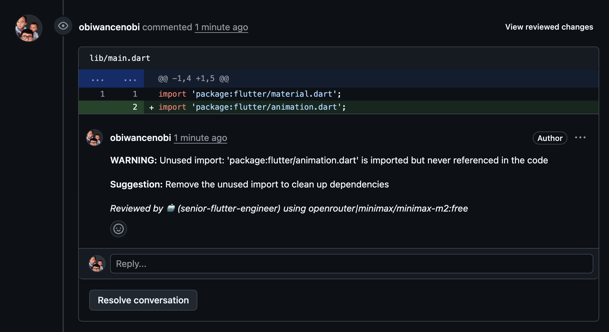
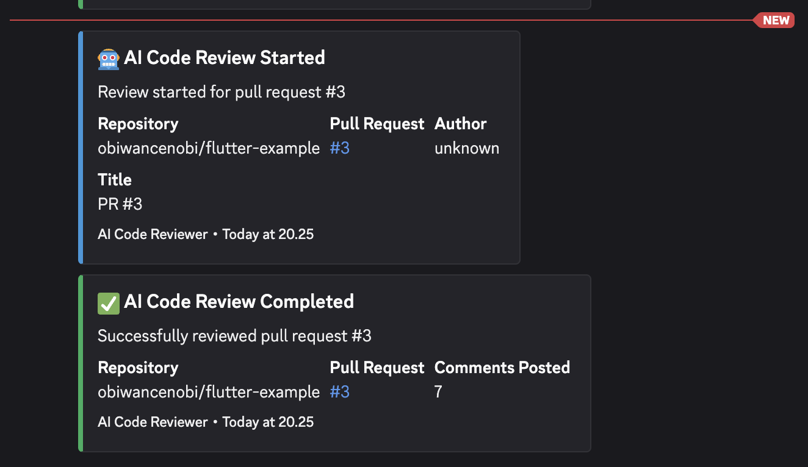
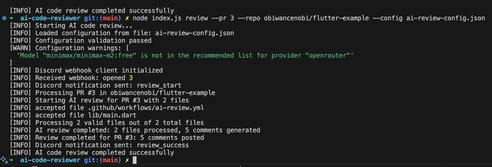

# BugBeaver Code Reviewer


[](https://nodejs.org/)
[](LICENSE)
[](https://github.com/features/actions)
[](https://github.com/obiwancenobi/ai-code-reviewer/releases)
[](https://openai.com/)
[](https://anthropic.com/)
[](https://ai.google/)
[](https://platform.deepseek.com/)
[](https://x.ai/)
[](https://groq.com/)
[](https://discord.com/)
[](https://jestjs.io/)
[](https://eslint.org/)
[](https://prettier.io/)
[](https://together.ai/)
[](https://fireworks.ai/)
[](https://mistral.ai/)
[](https://cerebras.ai/)
[](https://novita.ai/)
[](https://zenmux.ai/)
[](https://atlascloud.ai/)
[](https://cohere.com/)
[](https://minimax.io/)
[](https://moonshot.ai/)
[](https://upstage.ai/)
[](https://deepinfra.com/)

AI-powered code review automation for GitHub pull requests using configurable AI models and reviewer personas.

## 📸 Screenshots

### BugBeaver in Action

**Inline Comments on Pull Requests:**





**Discord Notifications:**


**CLI:**


*See the AI reviewer providing detailed code analysis with specific suggestions and line-by-line feedback, plus real-time Discord notifications showing AI model information for review status updates.*

## 🚀 Features

- **Multi-Provider AI Support**: OpenAI GPT-4, Anthropic Claude, Google Gemini, DeepSeek, OpenRouter, xAI Grok, Groq, Z.ai, Together AI, Fireworks AI, Mistral AI, Cerebras, Novita, ZenMux, Atlas Cloud, Cohere, Minimax, Moonshot, Upstage, and DeepInfra.
- **Configurable Reviewer Personas**: Senior Engineer, Security Expert, Performance Specialist, Accessibility Advocate
- **Smart File Processing**: Large file chunking, comprehensive exclusion patterns for all major development stacks (164+ patterns)
- **Discord Notifications**: Real-time status updates for review start, completion, and errors with AI model information
- **GitHub Integration**: Seamless PR commenting with inline and general review comments
- **Enterprise Ready**: Secure credential management, rate limiting, comprehensive error handling, robust JSON parsing
- **Universal Compatibility**: Works with any technology stack (Node.js, Python, Java, Flutter, .NET, Go, Rust, PHP, Ruby, etc.)

## 📋 Prerequisites

- GitHub repository with Actions enabled
- Node.js 20+ LTS
- AI API access (OpenAI, Anthropic, or other supported providers)
- Discord server (optional, for notifications)

## 🛠️ Quick Start

### GitHub Action (Recommended - Works with Any Tech Stack)

Add AI code review to any repository with one simple step:

1. **Create `.github/workflows/ai-review.yml`**:
   ```yaml
   name: AI Code Review

   on:
     pull_request:
       types: [opened, synchronize, reopened]

   jobs:
     ai-review:
       runs-on: ubuntu-latest
       if: github.event.pull_request.draft == false

       steps:
         - name: AI Code Review
           uses: obiwancenobi/ai-code-reviewer@v1.0.17
           with:
             pr-number: ${{ github.event.pull_request.number }}
             repository: ${{ github.repository }}
           env:
             GITHUB_TOKEN: ${{ secrets.GITHUB_TOKEN }}
             OPENAI_API_KEY: ${{ secrets.OPENAI_API_KEY }}
   ```

2. **Set up GitHub secrets** in your repository settings:
   - `GITHUB_TOKEN` (automatically provided by GitHub Actions)
   - `OPENAI_API_KEY` (or your chosen AI provider's API key)
   - `DISCORD_WEBHOOK_URL` (optional, for notifications)

3. **Commit and push**:
   ```bash
   git add .
   git commit -m "Add AI code review"
   git push
   ```

### Automated Setup

For a complete setup with examples:

```bash
# Run the automated setup script
curl -fsSL https://raw.githubusercontent.com/obiwancenobi/ai-code-reviewer/main/setup-workflow.sh | bash
```

### Advanced Configuration

Use repository variables for organization-wide settings:

```yaml
- name: AI Code Review
  uses: obiwancenobi/ai-code-reviewer@v1.0.17
  with:
    pr-number: ${{ github.event.pull_request.number }}
    repository: ${{ github.repository }}
    ai-provider: ${{ vars.AI_PROVIDER || 'openai' }}
    ai-model: ${{ vars.AI_MODEL || 'gpt-4' }}
    ai-persona: ${{ vars.AI_PERSONA || 'senior-engineer' }}
  env:
    GITHUB_TOKEN: ${{ secrets.GITHUB_TOKEN }}
    OPENAI_API_KEY: ${{ secrets.OPENAI_API_KEY }}
    ANTHROPIC_API_KEY: ${{ secrets.ANTHROPIC_API_KEY }}
    DISCORD_WEBHOOK_URL: ${{ secrets.DISCORD_WEBHOOK_URL }}
```

## ⚙️ Configuration

### AI Review Configuration (`ai-review-config.json`)

```json
{
  "ai": {
    "provider": "openai",
    "model": "gpt-4",
    "persona": "senior-engineer"
  },
  "processing": {
    "maxFileSize": 1048576,
    "chunkSize": 50000,
    "excludePatterns": [
      "node_modules/**",
      "build/**",
      "dist/**",
      "*.min.js",
      "*.lock",
      "DerivedData/**",
      ".gradle/**",
      "Pods/**",
      "__pycache__/**",
      "*.pyc",
      "target/**",
      "*.class",
      ".next/**",
      ".nuxt/**"
    ]
  }
}
```

**Provider-specific examples:**

**Anthropic Claude:**
```json
{
  "ai": {
    "provider": "anthropic",
    "model": "claude-3-sonnet",
    "persona": "security-expert"
  }
}
```

**Google Gemini:**
```json
{
  "ai": {
    "provider": "google",
    "model": "gemini-pro",
    "persona": "performance-specialist"
  }
}
```

**DeepSeek:**
```json
{
  "ai": {
    "provider": "deepseek",
    "model": "deepseek-coder",
    "persona": "senior-engineer"
  }
}
```

### Supported AI Providers

| Provider | Models | Environment Variable | Status |
|----------|--------|---------------------|--------|
| OpenAI | `gpt-4`, `gpt-4-turbo`, `gpt-3.5-turbo` | `OPENAI_API_KEY` | ✅ Production |
| Anthropic | `claude-3-sonnet`, `claude-3-haiku` | `ANTHROPIC_API_KEY` | ✅ Production |
| Google | `gemini-pro`, `gemini-pro-vision` | `GOOGLE_AI_API_KEY` | ✅ Production |
| DeepSeek | `deepseek-chat`, `deepseek-coder` | `DEEPSEEK_API_KEY` | ✅ Production |
| OpenRouter | Custom models | `OPENROUTER_API_KEY` | ✅ Production |
| xAI | `grok-1`, `grok-beta` | `XAI_API_KEY` | ✅ Production |
| Groq | `llama2-70b`, `mixtral-8x7b` | `GROQ_API_KEY` | ✅ Production |
| Z.ai | `z-model-1` | `ZAI_API_KEY` | ✅ Production |
| Together AI | `meta-llama/Llama-2-70b-chat-hf`, `codellama/CodeLlama-7b-Instruct-hf` | `TOGETHER_API_KEY` | ✅ Production |
| Fireworks AI | `accounts/fireworks/models/llama-v3p1-405b`, `accounts/fireworks/models/mixtral-8x7b-instruct` | `FIREWORKS_API_KEY` | ✅ Production |
| Mistral AI | `mistral-large-latest`, `open-mistral-7b` | `MISTRAL_API_KEY` | ✅ Production |
| Cerebras | `llama-3.1-8b`, `mixtral-8x7b` | `CEREBRAS_API_KEY` | ✅ Production |
| Novita | `novita-llama-3`, `novita-mistral` | `NOVITA_API_KEY` | ✅ Production |
| ZenMux | `zenmux-gpt-like`, `zenmux-coder` | `ZENMUX_API_KEY` | ✅ Production |
| Atlas Cloud | `atlas-gemini-pro`, `atlas-llama` | `ATLAS_CLOUD_API_KEY` | ✅ Production |
| Cohere | `command-r`, `command-r-plus` | `COHERE_API_KEY` | ✅ Production |
| Minimax | `minimax-chat`, `minimax-vision` | `MINIMAX_API_KEY` | ✅ Production |
| Moonshot | `moonshot-v1-8k`, `moonshot-kimi` | `MOONSHOT_API_KEY` | ✅ Production |
| Upstage | `solar-10.7b`, `solar-70b` | `UPSTAGE_API_KEY` | ✅ Production |
| DeepInfra | `deepinfra-llama3`, `deepinfra-mixtral` | `DEEPINFRA_API_KEY` | ✅ Production |

**Note**: Models listed are examples. Users can replace with any supported model for the provider as per their documentation and preferences.

### Reviewer Personas

#### Built-in Personas

- **`senior-engineer`**: General code quality, maintainability, best practices
- **`security-expert`**: Security vulnerabilities, data protection, secure coding
- **`performance-specialist`**: Performance optimization, scalability, efficiency
- **`accessibility-advocate`**: Inclusive design, WCAG compliance, user experience

#### Custom Personas

You can define custom reviewer personas with your own prompts:

```json
{
  "ai": {
    "provider": "openai",
    "model": "gpt-4",
    "persona": "code-reviewer",
    "customPersonas": {
      "code-reviewer": "You are an expert code reviewer focusing on clean code principles, SOLID design, and modern best practices. Pay special attention to naming conventions, function complexity, and code organization.",
      "team-lead": "You are a technical team lead reviewing code for architectural decisions, scalability concerns, and team standards compliance. Focus on long-term maintainability and technical debt.",
      "qa-engineer": "You are a QA engineer reviewing code for testability, error handling, and potential edge cases. Suggest improvements for debugging and monitoring."
    }
  }
}
```

**Custom persona features:**
- Define any persona name you want
- Write custom prompts tailored to your team's needs
- Mix built-in and custom personas in the same configuration
- Prompts can be as specific or general as needed

### Comment Attribution

AI review comments appear with the GitHub Actions bot identity and include AI model information. The author attribution is automatically handled by GitHub based on the token used for authentication.

**Example comment attribution:**
```
*Reviewed by 🦫 (senior-engineer) using openai/gpt-4*
```

**Note:** The `author` configuration option was removed as GitHub's API doesn't support custom author association for review comments. Comments will appear as coming from the authenticated user/bot associated with the `GITHUB_TOKEN`.

## 🔧 CLI Usage

```bash
# Validate configuration
node index.js validate --config ai-review-config.json

# Test Discord webhook
node index.js test-discord --webhook-url YOUR_WEBHOOK_URL

# Manual review (for testing)
node index.js review --pr 123 --repo owner/repo
```

## 📁 File Exclusions

The system automatically excludes common build artifacts and dependencies:

### Backend Stacks
- **Python**: `__pycache__/`, `*.pyc`, `venv/`, `.pytest_cache/`
- **Java**: `target/`, `*.class`, `*.jar`, `.gradle/`
- **.NET/C#**: `bin/`, `obj/`, `packages/`
- **Go**: `vendor/`, `*.exe`, `*.test`
- **Rust**: `target/`, `debug/`, `release/`
- **PHP**: `vendor/`, `composer.lock`
- **Ruby**: `.bundle/`, `vendor/bundle/`, `log/`, `tmp/`

### Frontend Stacks
- **React/Next.js**: `.next/`, `out/`, `.cache/`
- **Vue/Nuxt**: `.nuxt/`, `dist/`
- **Angular**: `dist/`, `build/`
- **General**: `node_modules/`, `dist/`, `build/`

### Mobile Stacks
- **iOS**: `DerivedData/`, `xcuserdata/`, `Pods/`, `Carthage/`
- **Android**: `.gradle/`, `build/`, `app/build/`
- **React Native**: `.expo/`, `platforms/`, `plugins/`
- **Flutter**: `.dart_tool/`, `build/`, `android/app/build/`
- **Cordova/Ionic**: `platforms/`, `plugins/`, `www/build/`

## 🎯 How It Works

1. **PR Trigger**: GitHub Actions workflow activates on pull request events
2. **Repository Checkout**: Action checks out the target repository code
3. **File Analysis**: System identifies changed files, applies comprehensive exclusion filters
4. **AI Processing**: Code is chunked if needed and sent to configured AI model
5. **Review Generation**: AI analyzes code using specified persona and generates comments
6. **Comment Posting**: Inline and general comments posted to GitHub PR with AI model attribution
7. **Notification**: Discord webhook sends status updates with AI model information (if configured)

## 🔧 Action Inputs

| Input | Required | Default | Description |
|-------|----------|---------|-------------|
| `pr-number` | Yes | - | Pull request number |
| `repository` | Yes | - | Repository name (owner/repo) |
| `config-file` | No | `ai-review-config.json` | Path to configuration file |
| `ai-provider` | No | `openai` | AI provider (openai, anthropic, google, etc.) |
| `ai-model` | No | `gpt-4` | AI model to use |
| `ai-persona` | No | `senior-engineer` | Reviewer persona |

## 🔑 Required Secrets

- `GITHUB_TOKEN`: Automatically provided by GitHub Actions
- One AI provider API key: `OPENAI_API_KEY`, `ANTHROPIC_API_KEY`, `GOOGLE_AI_API_KEY`, `DEEPSEEK_API_KEY`, `OPENROUTER_API_KEY`, `XAI_API_KEY`, `GROQ_API_KEY`, `ZAI_API_KEY`, `TOGETHER_API_KEY`, `FIREWORKS_API_KEY`, `MISTRAL_API_KEY`, `CEREBRAS_API_KEY`, `NOVITA_API_KEY`, `ZENMUX_API_KEY`, `ATLAS_CLOUD_API_KEY`, `COHERE_API_KEY`, `MINIMAX_API_KEY`, `MOONSHOT_API_KEY`, `UPSTAGE_API_KEY`, `DEEPINFRA_API_KEY`
- `DISCORD_WEBHOOK_URL`: Optional, for notifications

## ⚙️ Configuration Priority

Settings are applied in this priority order (highest to lowest):

| Source | Example | Priority | Use Case |
|--------|---------|----------|----------|
| **Action Inputs** | `ai-provider: 'anthropic'` | 1️⃣ Highest | Repository-specific overrides |
| **Repository Variables** | `vars.AI_PROVIDER` | 2️⃣ High | Organization-wide defaults |
| **Environment Variables** | `secrets.ANTHROPIC_API_KEY` | 3️⃣ Medium | Secure credential management |
| **Config File** | `ai-review-config.json` | 4️⃣ Low | Baseline settings |
| **Defaults** | `'openai'` | 5️⃣ Lowest | Fallback values |

### Example Priority Resolution

**Config file sets:**
```json
{
  "ai": {
    "provider": "openai",
    "model": "gpt-4"
  }
}
```

**Workflow sets:**
```yaml
- uses: obiwancenobi/ai-code-reviewer@v1.0.17
  with:
    ai-provider: ${{ vars.AI_PROVIDER || 'anthropic' }}
    ai-model: ${{ vars.AI_MODEL || 'claude-3-sonnet' }}
```

**Result:**
- `ai-provider`: `anthropic` (from repository variable)
- `ai-model`: `claude-3-sonnet` (from repository variable)
- Other settings from config file or defaults

### Recommended Setup Strategy

**For Individual Repositories:**
- Use action inputs for repository-specific settings
- Use config file for baseline configuration

**For Organizations:**
- Set organization variables for consistent AI provider/model
- Use repository variables for team-specific overrides
- Keep sensitive settings in GitHub secrets

## 🔒 Security & Permissions

### GitHub Permissions Required

Your workflow must include these permissions for the AI Code Reviewer to access pull request data and create comments:

```yaml
permissions:
  contents: read      # Required: Read repository contents
  pull-requests: write # Required: Read PR files and create review comments
  issues: write       # Required: Create issue comments
```

**Example workflow configuration:**
```yaml
jobs:
  ai-review:
    runs-on: ubuntu-latest
    permissions:
      contents: read
      pull-requests: write
      issues: write
    steps:
      # ... your steps
```

### Security Features

- API keys stored securely as GitHub Secrets
- No source code persistence in logs or cache
- Secure webhook validation
- Rate limiting and error handling
- Principle of least privilege for GitHub tokens

## 📊 Performance

- **Processing Time**: <10 minutes for repositories <100MB (depends on AI provider response times)
- **File Size Limit**: 1MB per file (configurable)
- **Chunking**: Automatic splitting for large files
- **Concurrency**: Parallel file processing with rate limiting and error resilience

## 🔄 Usage Examples

### Basic Usage (Any Repository)

```yaml
name: AI Code Review

on:
  pull_request:
    types: [opened, synchronize, reopened]

jobs:
  ai-review:
    runs-on: ubuntu-latest

    steps:
      - name: AI Code Review
        uses: obiwancenobi/ai-code-reviewer@v1.0.17
        with:
          pr-number: ${{ github.event.pull_request.number }}
          repository: ${{ github.repository }}
        env:
          GITHUB_TOKEN: ${{ secrets.GITHUB_TOKEN }}
          OPENAI_API_KEY: ${{ secrets.OPENAI_API_KEY }}
```

### Technology-Specific Examples

#### Flutter/Dart Projects
```yaml
name: AI Code Review

on:
  pull_request:
    types: [opened, synchronize, reopened]
    paths-ignore:
      - '**/android/**'
      - '**/ios/**'
      - '**/*.png'
      - '**/*.jpg'

jobs:
  ai-review:
    runs-on: ubuntu-latest

    steps:
      - name: AI Code Review
        uses: obiwancenobi/ai-code-reviewer@v1.0.17
        with:
          pr-number: ${{ github.event.pull_request.number }}
          repository: ${{ github.repository }}
          ai-persona: 'senior-engineer'
        env:
          GITHUB_TOKEN: ${{ secrets.GITHUB_TOKEN }}
          OPENAI_API_KEY: ${{ secrets.OPENAI_API_KEY }}
```

#### Python Projects
```yaml
- name: AI Code Review
  uses: obiwancenobi/ai-code-reviewer@v1.0.17
  with:
    pr-number: ${{ github.event.pull_request.number }}
    repository: ${{ github.repository }}
    ai-persona: 'performance-specialist'
  env:
    GITHUB_TOKEN: ${{ secrets.GITHUB_TOKEN }}
    OPENAI_API_KEY: ${{ secrets.OPENAI_API_KEY }}
```

#### Java/.NET Projects
```yaml
- name: AI Code Review
  uses: obiwancenobi/ai-code-reviewer@v1.0.17
  with:
    pr-number: ${{ github.event.pull_request.number }}
    repository: ${{ github.repository }}
    ai-provider: 'anthropic'
    ai-model: 'claude-3-sonnet-20240229'
    ai-persona: 'security-expert'
  env:
    GITHUB_TOKEN: ${{ secrets.GITHUB_TOKEN }}
    ANTHROPIC_API_KEY: ${{ secrets.ANTHROPIC_API_KEY }}
```

### Advanced Configuration

#### Using Repository Variables (Organization Setup)
Set these in repository Settings → Actions → Variables:
- `AI_PROVIDER`: `anthropic`
- `AI_MODEL`: `claude-3-sonnet-20240229`
- `AI_PERSONA`: `security-expert`

```yaml
- name: AI Code Review
  uses: obiwancenobi/ai-code-reviewer@v1.0.17
  with:
    pr-number: ${{ github.event.pull_request.number }}
    repository: ${{ github.repository }}
    ai-provider: ${{ vars.AI_PROVIDER || 'openai' }}
    ai-model: ${{ vars.AI_MODEL || 'gpt-4' }}
    ai-persona: ${{ vars.AI_PERSONA || 'senior-engineer' }}
  env:
    GITHUB_TOKEN: ${{ secrets.GITHUB_TOKEN }}
    OPENAI_API_KEY: ${{ secrets.OPENAI_API_KEY }}
    ANTHROPIC_API_KEY: ${{ secrets.ANTHROPIC_API_KEY }}
    DISCORD_WEBHOOK_URL: ${{ secrets.DISCORD_WEBHOOK_URL }}
```

#### Custom Configuration File
Create `ai-review-config.json` in your repository:

```json
{
  "ai": {
    "customPersonas": {
      "team-lead": "You are a technical team lead reviewing for architecture and scalability..."
    }
  },
  "processing": {
    "maxFileSize": 2097152,
    "excludePatterns": [
      "custom-exclude/**"
    ]
  }
}
```

### Automated Setup

For complete setup with examples, run:

```bash
curl -fsSL https://raw.githubusercontent.com/obiwancenobi/ai-code-reviewer/main/setup-workflow.sh | bash
```

This creates workflow examples for different approaches and provides setup guidance.

## ⚠️ Important Considerations

### Data Privacy
- Code snippets, prompts, and related metadata are transmitted to third-party AI providers, which may log or store this data for their operations.
- Refrain from including sensitive credentials, proprietary information, or personal data in reviews unless you're confident in the provider's security practices.

### Service Stability
- External AI services may enforce usage limits, alter their APIs or model behaviors abruptly, or become temporarily unavailable.
- Treat AI-generated outputs as preliminary suggestions; incorporate manual checks before relying on them in live environments.

### Output Verification
- AI responses might include factual errors, rely on obsolete information, or fabricate elements not present in the input.
- Independently validate all recommendations, code modifications, or analyses provided by the AI before integration.

## 🛠️ Troubleshooting

### Common Issues and Solutions

#### 1. **API Key Errors**
- **Error**: "Missing API key for [provider]. Set [ENV_VAR] environment variable."
  - **Solution**: Ensure the correct environment variable is set in GitHub Secrets (e.g., `OPENAI_API_KEY`, `COHERE_API_KEY`). Verify the variable name matches the provider exactly.
- **Error**: "Invalid API key" or 401 Unauthorized.
  - **Solution**: Double-check the API key from the provider dashboard. Regenerate if necessary and update the secret.

#### 2. **Provider Not Supported**
- **Error**: "Unsupported AI provider: [provider]"
  - **Solution**: Confirm the provider name in `ai-review-config.json` or workflow inputs matches the enum (e.g., 'cohere-ai', not 'cohere'). Check the [Supported AI Providers table](#supported-ai-providers) for exact names.

#### 3. **Rate Limit Exceeded**
- **Error**: 429 Too Many Requests or similar from AI provider.
  - **Solution**: Wait and retry, or upgrade to a higher tier on the provider. The tool includes retry logic (3 attempts), but persistent issues may require adjusting concurrency or using a different provider.

#### 4. **Configuration Validation Failed**
- **Error**: "Invalid ai.provider" or schema errors in logs.
  - **Solution**: Run CLI validation: `node index.js validate --config ai-review-config.json`. Fix enum mismatches or missing required fields like `ai.model`.

#### 5. **GitHub Permissions Issues**
- **Error**: "Resource not accessible by integration" or no comments posted.
  - **Solution**: Add permissions to workflow:
    ```yaml
    permissions:
      contents: read
      pull-requests: write
      issues: write
    ```
    Ensure `GITHUB_TOKEN` has repo scope.

#### 6. **Discord Webhook Failures**
- **Error**: "Discord webhook failed" in logs.
  - **Solution**: Verify `DISCORD_WEBHOOK_URL` secret is correct and the webhook has permissions in the Discord channel. Test with CLI: `node index.js test-discord --webhook-url YOUR_URL`.

#### 7. **Large File or Chunking Problems**
- **Error**: "File too large" or incomplete reviews.
  - **Solution**: Increase `processing.maxFileSize` in config (default 1MB). For very large files, adjust `chunkSize` (default 50k tokens). Exclude binary/large files via `excludePatterns`.

#### 8. **JSON Parsing Errors from AI**
- **Error**: "Failed to parse AI response as JSON" in logs; fallback general comment.
  - **Solution**: The tool uses robust parsing with fallbacks. If persistent, check provider response format or refine the prompt in custom personas. Test with a simple code snippet.

#### 9. **No Review Comments on PR**
- **Error**: Workflow succeeds but no comments appear.
  - **Solution**: Check workflow logs for skipped files (exclusions). Ensure PR is not draft (`if: github.event.pull_request.draft == false`). Verify changed files are code (not docs/images).

#### 10. **Workflow Not Triggering**
- **Error**: No action runs on PR.
  - **Solution**: Confirm workflow file in `.github/workflows/` and PR events in `on: pull_request`. Check repository Actions settings for approval if required.

### General Debugging Tips
- **Enable Debug Logs**: Set `DEBUG=*` env var in workflow for verbose output.
- **Test Locally**: Use CLI for manual reviews: `node index.js review --pr <number> --repo <owner/repo>`.
- **Check Provider Status**: Visit provider dashboards for outages or quota issues.
- **Review Logs**: GitHub Actions logs show detailed errors; search for "AI code review" or provider names.

For persistent issues, open an [issue](https://github.com/obiwancenobi/ai-code-reviewer/issues) with workflow logs and config (redact keys).

## 🤝 Contributing

1. Fork the repository
2. Create a feature branch: `git checkout -b feature/amazing-feature`
3. Commit changes: `git commit -m 'Add amazing feature'`
4. Push to branch: `git push origin feature/amazing-feature`
5. Open a Pull Request

## 📝 License

This project is licensed under the MIT License - see the [LICENSE](LICENSE) file for details.

## 🙏 Acknowledgments

- Built with [Node.js](https://nodejs.org/)
- Powered by multiple AI providers
- Integrated with [GitHub Actions](https://github.com/features/actions)
- Notifications via [Discord](https://discord.com/)

## 📞 Support

- 📖 [Quick Start Guide](specs/001-ai-code-review/quickstart.md)
- 🐛 [Issues](https://github.com/obiwancenobi/ai-code-reviewer/issues)
- 💬 [Discussions](https://github.com/obiwancenobi/ai-code-reviewer/discussions)
- 📧 [Setup Script](https://raw.githubusercontent.com/obiwancenobi/ai-code-reviewer/main/setup-workflow.sh)
