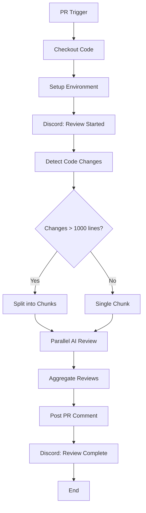

# GitHub Actions Workflow Architecture for AI-Powered Code Review System

## Overview
This document outlines the architectural design for a GitHub Actions workflow that implements an AI-powered code review system. The workflow integrates with OpenRouter API for AI reviews and Discord for notifications, with support for large PR handling through chunking.

## Workflow Triggers and Inputs

### Triggers
- `pull_request`: Triggered on `opened`, `synchronize`, and `reopened` events
- `workflow_dispatch`: Manual trigger with dynamic inputs

### Inputs (for workflow_dispatch)
- `ai_model`: String (default: "anthropic/claude-3-haiku:beta")
  - Options: "anthropic/claude-3-haiku:beta", "openai/gpt-4", "meta-llama/llama-3.1-70b-instruct"
- `discord_webhook_url`: String (optional, overrides repository secret)

## Job Structure

### Single Job: `ai-code-review`
Runs on `ubuntu-latest` with the following steps:

1. **Checkout Repository**
   - Uses `actions/checkout@v4`
   - Fetches full history for diff analysis

2. **Setup Node.js**
   - Uses `actions/setup-node@v4`
   - Node 18+ for JavaScript tooling

3. **Install Dependencies**
   - Runs `npm ci` for consistent installs

4. **Discord Notification Start**
   - Sends initial notification to Discord
   - Includes PR details and start timestamp

5. **Code Change Detection**
   - Analyzes git diff to identify changed files
   - Filters for relevant file types (js, ts, py, etc.)
   - Calculates total lines changed

6. **Chunking Logic**
   - If total changes > 1000 lines, splits into chunks
   - Each chunk contains related files (max 500 lines per chunk)
   - Maintains file relationships and dependencies

7. **AI Review via OpenRouter**
   - Parallel processing of chunks (if multiple)
   - Constructs prompts with:
     - Actor data (PR author, reviewers)
     - Code changes
     - Repository context
     - Review guidelines
   - Calls OpenRouter API with selected model

8. **PR Commenting**
   - Aggregates AI review results
   - Posts comprehensive comment on PR
   - Includes review summary, suggestions, and ratings

9. **Discord Notification Completion**
   - Sends completion notification
   - Includes review summary and status

## Required Secrets and Environment Variables

### Repository Secrets
- `OPENROUTER_API_KEY`: API key for OpenRouter service
- `DISCORD_WEBHOOK_URL`: Default Discord webhook URL

### Environment Variables
- `GITHUB_TOKEN`: Automatically provided by GitHub
- `PR_NUMBER`: From GitHub context
- `PR_AUTHOR`: From GitHub context
- `CHANGES_SIZE`: Calculated during execution

## Data Flow

```
PR Event → Checkout → Setup → Install Deps
    ↓
Discord Start → Change Detection → Chunking
    ↓
AI Review (Parallel Chunks) → Aggregate Results
    ↓
PR Comment → Discord Completion
```

### Data Transformation Points
1. **Git Diff → File List**: Raw diff converted to structured file changes
2. **File List → Chunks**: Large changes split into manageable pieces
3. **Chunks → AI Prompts**: Code changes formatted with context
4. **AI Responses → Review Comments**: Individual reviews combined into cohesive feedback

## Error Handling and Resilience

- **Timeout Protection**: 15-minute timeout per job
- **Retry Logic**: Failed API calls retry with exponential backoff
- **Partial Failure Handling**: Continue with available chunks if some fail
- **Discord Alerts**: Notify on failures and timeouts

## Security Considerations

- API keys stored as encrypted secrets
- No sensitive data in workflow logs
- Input validation for dynamic parameters
- Rate limiting awareness for API calls

## Performance Optimizations

- Parallel chunk processing
- Caching of unchanged dependencies
- Efficient diff parsing
- Minimal API calls through batching

## Monitoring and Logging

- Detailed step logs for debugging
- Discord notifications for status updates
- PR comments with review metadata
- Workflow run summaries in repository actions

## Mermaid Diagram



This architecture provides a scalable, maintainable solution for AI-powered code reviews with comprehensive error handling and user feedback through Discord integration.